# AI-Platform笔记

## 目录

- [1  项目初始化](#1--项目初始化)
  - [1.1  后端项目初始化](#11--后端项目初始化)
  - [1.2  前端项目初始化](#12--前端项目初始化)
  - [1.3  Tips](#13--Tips)
- [2  用户模块](#2--用户模块)
  - [2.1  需求分析](#21--需求分析)
  - [2.2  方案设计](#22--方案设计)
  - [2.3  后端开发](#23--后端开发)
  - [2.4  前端开发](#24--前端开发)
- [3  AI生成应用](#3--AI生成应用)
  - [3.1  需求分析](#31--需求分析)
  - [3.2  方案设计](#32--方案设计)
  - [3.3  实现AI应用生成](#33--实现AI应用生成)
  - [3.4  SSE流式输出](#34--SSE流式输出)
  - [3.5  代码优化（抽象）](#35--代码优化抽象)
- [4  应用模块](#4--应用模块)
  - [4.1  需求分析](#41--需求分析)
  - [4.2  方案设计 ](#42--方案设计-)
  - [4.3  基础应用能力](#43--基础应用能力)
  - [4.4  应用生成（后端）](#44--应用生成后端)
  - [4.5  应用部署（后端）](#45--应用部署后端)
  - [4.6  前端开发](#46--前端开发)
- [5  对话历史模块](#5--对话历史模块)
  - [5.1  需求分析](#51--需求分析)
  - [5.2  方案设计](#52--方案设计)
  - [5.3  对话历史后端开发](#53--对话历史后端开发)
  - [5.4  对话历史前端开发](#54--对话历史前端开发)
  - [5.5  对话记忆](#55--对话记忆)
  - [5.6  Redis分布式Session](#56--Redis分布式Session)

## 1  项目初始化

### 1.1  后端项目初始化

1. 环境准备
   - **JDK 版本**：21
   - **MySQL 数据库版本**：8.0
   - **Spring Boot版本**： 3.5.4&#x20;
2. 整合开发项目中的常用依赖
   - Hutool工具库

     **参考官方文档引入**：[https://doc.hutool.cn/pages/index/#%F0%9F%8D%8Amaven](https://doc.hutool.cn/pages/index/#🍊maven "https://doc.hutool.cn/pages/index/#%F0%9F%8D%8Amaven")

     Hutool 是主流的 Java 工具类库，集合了丰富的工具类，涵盖字符串处理、日期操作、文件处理、加解密、反射、正则匹配等常见功能。它的轻量化和无侵入性让开发者能够专注于业务逻辑而不必编写重复的工具代码。例如，`DateUtil.formatDate(new Date())` 可以快速将当前日期格式化为字符串。

     **引入方式：** 在 Maven 的 pom.xml 中添加依赖
   - Knife4j接口文档

     **参考官方文档引入**：[https://doc.xiaominfo.com/docs/quick-start#spring-boot-3](https://doc.xiaominfo.com/docs/quick-start#spring-boot-3 "https://doc.xiaominfo.com/docs/quick-start#spring-boot-3")

     Knife4j 是基于 Swagger 接口文档的增强工具，提供了更加友好的‌ API 文档界面和功能扩展，例如动态参数调试、分组文‎档等。它适合用于 Spring Boot 项目‍中，能够通过简单的配置自动生成接口文档，让开发者和⁠前端快速了解和调试接口，提高协作效率。

     引入方式：（1）在 Maven 的 pom.xml 中添加依赖；（2）在 `application.yml` 中追加接口文档配置，重点是指定扫描 Controller 包的路径（参考第一次提交的代码中的springdoc-openapi以及knife4j的配置）

     访问 [http://localhost:8123/api/doc.html](http://localhost:8123/api/doc.html "http://localhost:8123/api/doc.html") 能够看到接口文档，可以测试调用接口
   - 其他依赖

     引入了AOP切面编程的依赖
3. 通用基础代码
   - 目录总览

     

     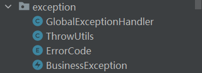
   - BaseResponse\<T>：通用响应类

     这是一种后端接口返回结果的统一封装类。它包含了常用的三个字段：状态码（`code`）、数据（`data`）、消息（`message`）。通过不同的构造方法，可以灵活地构建成功或失败的响应，便于前后端交互标准化。
   - DeleteRequest：删除封装类

     这是一个简单的请求参数封装类，用于处理删除操作时传递的 id 值。通过统一定义删除请求格式，提高了接口的规范性和可维护性。
   - PageRequest：请求封装类

     该类用于接收分页查询参数，包括当前页码（`pageNum`）、每页数量（`pageSize`）、排序字段（`sortField`）和排序顺序（`sortOrder`）。这是实现列表查询时的标准参数封装，支持灵活的分页与排序功能。
   - ResultUtils：快速构造响应结果的工具类

     这是一个静态工具类，提供了一系列快速构造统一响应的静态方法。支持成功和失败两种场景的构建，配合`BaseResponse`使用，大大简化了 Controller 层的响应逻辑，让代码更简洁、规范。
   - GlobalExceptionHandler：全局异常处理类

     这个类是基于 Spring Boot 的全局异常捕获器，用于统一处理项目中的运行时异常和业务异常。通过注解`@RestControllerAdvice`和`@ExceptionHandler`，可以拦截指定异常类型，并返回统一格式的响应，提升系统的健壮性和用户体验。
   - ThrowUtils：条件异常工具类

     这是一个用于简化异常抛出的工具类。提供多个`throwIf`方法，按需传入条件和异常（或错误码），在条件满足时自动抛出对应的业务异常。这种写法提高了代码的可读性和复用性，避免大量重复的`if + throw`语句。
   - ErrorCode：错误码枚举类

     这是一个用于统一定义系统错误类型的枚举类，每个枚举值代表一种错误场景（如参数错误、未登录、系统异常等），包含错误码和错误信息。统一管理错误码有助于接口规范化、排查问题和前后端协作。
   - BusinessException：业务异常类

     这是自定义的业务异常类，继承自 RuntimeException，用于抛出应用中的特定错误。它可以接收自定义错误码或 ErrorCode 枚举，结合 GlobalExceptionHandler 可实现清晰、统一的异常响应机制。

### 1.2  前端项目初始化

1. 环境准备

   **Node.js 版本**：v20.19.0

   **Vue 版本**：v3.17.0

   可参考视频安装 Node.js：[https://www.bilibili.com/video/BV14SUNYREv8](https://www.bilibili.com/video/BV14SUNYREv8 "https://www.bilibili.com/video/BV14SUNYREv8")

   使用 Vue 官方推荐的脚手架 create-vue 快速创建 Vue3 的项目：[https://cn.vuejs.org/guide/quick-start.html](https://cn.vuejs.org/guide/quick-start.html "https://cn.vuejs.org/guide/quick-start.html")
2. 引入组件库

   **Ant Design Vue 版本**：v4.2.6

   引入 Ant Design Vue 组件库，参考 [官方文档](https://antdv.com/docs/vue/getting-started-cn "官方文档") 快速上手。
3. 页面基本信息、路由、请求等

   具体的代码可以参考第一次提交的内容

### 1.3  Tips

Lombok注解以及引入的注意事项：

Lombok 是一个 **Java 库**，通过注解（Annotation）的方式 **自动生成 Java 代码**（如 getter/setter、构造方法、Builder 模式等），减少样板代码，提高开发效率。

在 **Spring Boot 3.x 及更高版本** 中，如果引入 Lombok 时，**不会指定版本号**。这可能会导致**编译错误**（如注解不生效）。因此，我们需要主动在pom.xml文件中指定lombok的版本号：

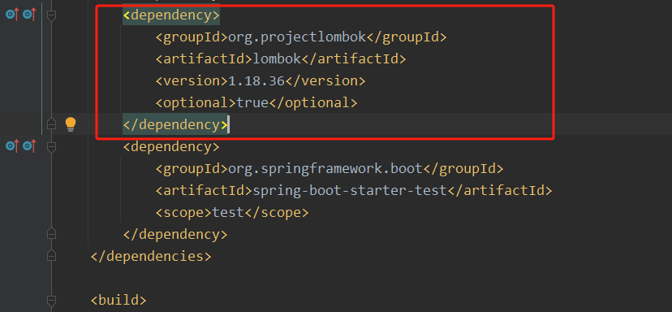

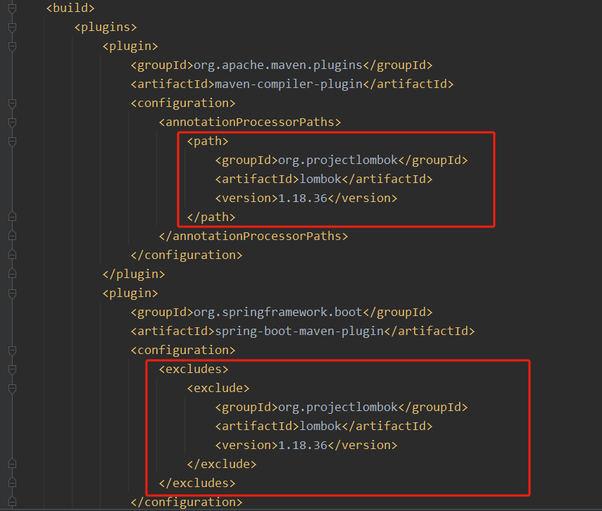

## 2  用户模块

### 2.1  需求分析

对于用户模块，通常要具有下列功能：

- 用户注册
- 用户登录
- 获取当前登录用户
- 用户注销
- 用户权限控制
- 【管理员】管理用户

具体分析每个需求：

1）用户注册：用户可以通过输入账号、密码、确认密码进行注册

2）用户登录：用户可以通过输入账号和密码登录

3）获取当前登录用户：得到当‌前已经登录的用户信‎息（不用重复登录）

4）用户注销：用户可以退出登录

5）用户权限控制：用户又分为‌普通用户和管理员，‎管理员拥有整个系统‍的最高权限，比如可⁠以管理其他用户

6）用户管理：仅管理员可用，‌可以对整个系统中的‎用户进行管理，比如‍搜索用户、删除用户

### 2.2  方案设计

1. 库表设计

   数据库名：tao\_ai\_code\_platform

   用户表名：user

   用户表的核心是用户登录凭证（账号密‌码）和个人信息，SQL‎ 如下：
   ```sql 
   -- 用户表
   create table if not exists user
   (
       id           bigint auto_increment comment 'id' primary key,
       userAccount  varchar(256)                           not null comment '账号',
       userPassword varchar(512)                           not null comment '密码',
       userName     varchar(256)                           null comment '用户昵称',
       userAvatar   varchar(1024)                          null comment '用户头像',
       userProfile  varchar(512)                           null comment '用户简介',
       userRole     varchar(256) default 'user'            not null comment '用户角色：user/admin',
       editTime     datetime     default CURRENT_TIMESTAMP not null comment '编辑时间',
       createTime   datetime     default CURRENT_TIMESTAMP not null comment '创建时间',
       updateTime   datetime     default CURRENT_TIMESTAMP not null on update CURRENT_TIMESTAMP comment '更新时间',
       isDelete     tinyint      default 0                 not null comment '是否删除',
       UNIQUE KEY uk_userAccount (userAccount),
       INDEX idx_userName (userName)
   ) comment '用户' collate = utf8mb4_unicode_ci;

   ```

   几个注意事项：
   - editTime 和 updateTime 的区别：editTime 表示用户编辑个人信息的时间（需要业务代码来更新），而 updateTime 表示这条用户记录任何字段发生修改的时间（由数据库自动更新）。
   - 给唯一值添加唯一键（唯一索引），比如账号 userAccount，利用数据库天然防重复，同时可以增加查询效率。
   - 给经常用于查询的字段添加索引，比如用户昵称 userName，可以增加查询效率。
2. 用户登录流程
   - 建立初始会话：前端与服务器建立连接后，服务器‌会为该客户端创建一个初始的匿名 ‎Session，并将其状态保‍存下来。这个 Session 的 I⁠D 会作为唯一标识，返回给前端。
   - 登录成功，更新会话信息：当用户在前端输入正确的账号密码并提交到后端验证成功后，后端会‌更新该用户的 Session，将用户的登录信息（如用户 I‎D、用户名等）保存到与该 Session 关联的存储中。同‍时，服务器会生成一个 Set-Cookie 的响应头，指示⁠前端保存该用户的 Session ID。
   - 前端保存 Cookie：前端接收到后端的响应‌后，浏览器会自动根据 Set-C‎ookie 指令，将 Sessi‍on ID 存储到浏览器的 Co⁠okie 中，与该域名绑定。
   - 带 Cookie 的后续请求：当前端再‌次向相同域名的服务器发送请求‎时，浏览器会自动在请求头中附‍带之前保存的 Cookie，⁠其中包含 Session ID。
   - 后端验证会话：服务器接收到‌请求后，从请求头中提‎取 Session ‍ID，找到对应的 S⁠ession 数据。
   - 获取会话中存储的信息：后端通过该‌ Session 获取之‎前存储的用户信息（如登录‍名、权限等），从而识别用⁠户身份并执行相应的业务逻辑。
3. 对用户权限进行控制
   - 可以将接口分为 4 种权限：
     1. 未登录也可以使用
     2. 登录用户才能使用
     3. 未登录也可以使用，但是登录用户能进行更多操作（比如登录后查看全文）
     4. 仅管理员才能使用
   - 一般会通过 **Spring AOP 切面 + 自定义权限校验注解** 实现统一的接口拦截和权限校验；如果有特殊的权限校验逻辑，再单独在接口中编码。

### 2.3  后端开发

1. 数据库建表
   - 利用 IDEA‍ 连接 MySQL⁠ 数据库
   - 执行  `sql/create_table.sql` 脚本文件，创建数据库表
2. MyBatis Flex 代码生成器
   - 什么是 MyBatis Flex
     - 数据访问层框架，它的作用和 MyBatis Plus 一样，都是对传统操作数据库的 MyBatis 框架进行增强。它的 3 大优势：
       - 更轻量：MyBatis-Flex 除了 MyBatis 本身，再无任何第三方依赖，因此会带来更高的自主性、把控性和稳定性。在任何一个系统中，依赖越多，稳定性越差。
       - 更灵活：MyBatis-Flex 提供了非常灵活的 QueryWrapper，支持关联查询、多表查询、多主键、逻辑删除、乐观锁更新、数据填充、数据脱敏等等。
       - 更高的性能：MyBatis-Flex 通过独特的架构，没有任何 MyBatis 拦截器、在 SQL 执行的过程中，没有任何的 SQL Parse，因此会带来指数级的性能增长。
         [官方文档](https://mybatis-flex.com/zh/intro/comparison.html "官方文档") 中的功能对比：
       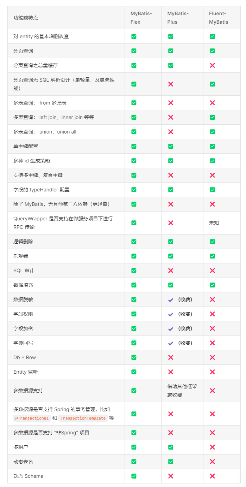
   - 使用代码生成器
     - 参考 [官方文档](https://mybatis-flex.com/zh/others/codegen.html "官方文档") 使用代码生成器
     - 在pom.xml中引入相关依赖
     - application.yml中编写相关配置
     - 代码：
       ```java 
       public class MyBatisCodeGenerator {

           // 需要生成的表名，如果有多张表，就写 {"user","xxx"}
           private static final String[] TABLE_NAMES = {"user"};

           public static void main(String[] args) {
               // 获取数据源信息
               Dict dict = YamlUtil.loadByPath("application.yml");
               Map<String, Object> dataSourceConfig = dict.getByPath("spring.datasource");
               String url = String.valueOf(dataSourceConfig.get("url"));
               String username = String.valueOf(dataSourceConfig.get("username"));
               String password = String.valueOf(dataSourceConfig.get("password"));
               // 配置数据源
               HikariDataSource dataSource = new HikariDataSource();
               dataSource.setJdbcUrl(url);
               dataSource.setUsername(username);
               dataSource.setPassword(password);

               // 创建配置内容
               GlobalConfig globalConfig = createGlobalConfig();

               // 通过 datasource 和 globalConfig 创建代码生成器
               Generator generator = new Generator(dataSource, globalConfig);

               // 生成代码
               generator.generate();
           }

           // 详细配置见：https://mybatis-flex.com/zh/others/codegen.html
           public static GlobalConfig createGlobalConfig() {
               // 创建配置内容
               GlobalConfig globalConfig = new GlobalConfig();

               // 设置根包，建议先生成到一个临时目录下，生成代码后，再移动到项目目录下
               globalConfig.getPackageConfig()
                       .setBasePackage("com.yupi.yuaicodemother.genresult");

               // 设置表前缀和只生成哪些表，setGenerateTable 未配置时，生成所有表
               globalConfig.getStrategyConfig()
                       .setGenerateTable(TABLE_NAMES)
                       // 设置逻辑删除的默认字段名称
                       .setLogicDeleteColumn("isDelete");

               // 设置生成 entity 并启用 Lombok
               globalConfig.enableEntity()
                       .setWithLombok(true)
                       .setJdkVersion(21);

               // 设置生成 mapper
               globalConfig.enableMapper();
               globalConfig.enableMapperXml();

               // 设置生成 service
               globalConfig.enableService();
               globalConfig.enableServiceImpl();

               // 设置生成 controller
               globalConfig.enableController();

               // 设置生成时间和字符串为空，避免多余的代码改动
               globalConfig.getJavadocConfig()
                       .setAuthor("<a href=\"https://github.com/liyupi\">程序员鱼皮</a>")
                       .setSince("");
               return globalConfig;
           }
       }

       ```

     - 实行完毕后，会在genresult 目录下生成相应代码：

       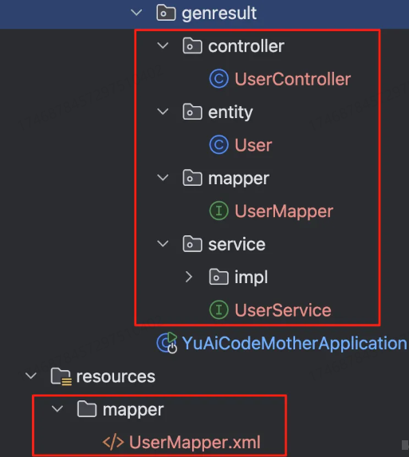
     - 主类添加扫描 Mapper 文件的注解：
       ```java 
       @SpringBootApplication
       @MapperScan("com.tao.taoaicodeplatform.mapper")
       public class YuAiCodeMotherApplication {
           public static void main(String[] args) {
               SpringApplication.run(TaoAiCodePlatformApplication.class, args);
           }
       }
       ```

3. 数据模型开发
   - 实体类
     - 修改 User 类的代码如下：
       ```java 
       @Table("user")
       public class User implements Serializable {

           @Id(keyType = KeyType.Generator, value = KeyGenerators.snowFlakeId)
           private Long id;
       }
       ```

     - id 默认是连续生成的，容易被爬虫抓取，所以更换策略为 `ASSIGN_ID` **雪花算法**生成。
       - 雪花算法一般是用来实现全局唯一的业务主键，解决分库分表之后主键id的唯一性问题。
       - 雪花算法生成的ID是一个64位的 Long 类型数字，由以下几部分组成：
         1. **符号位(1位)**：始终为0，保证ID为正数
         2. **时间戳(41位)**：精确到毫秒，可以使用约69年
         3. **数据中心ID(5位)**：最多支持32个数据中心
         4. **机器ID(5位)**：每个数据中心最多支持32台机器
         5. **序列号(12位)**：每毫秒可以生成4096个ID
            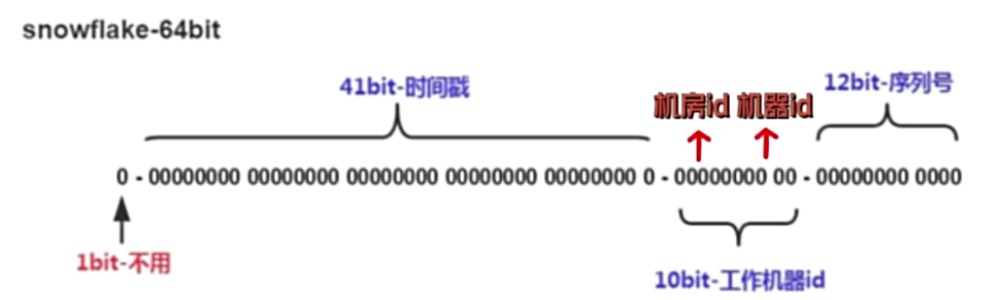
       - 雪花算法是一种生成分布式全局唯一id的算法，它会得到一个64位的long类型的数据，其中这64位的数据由4个部分组成：（1）第一个部分是一个符号位，因为id不会是负数，所以它始终为0；（2）接着，用41位来表示毫秒单位的时间戳；（3）再用10位来表示工作机器的id；（4）最后，用12位来表示递增的序列号。
   - 枚举类
     - 对于用户角色这样值的数量有限的‌、可枚举的字段，最好‎定义一个枚举类，便于‍在项目中获取值、减少⁠枚举值输入错误的情况。
     - 代码：
       ```java 
       @Getter
       public enum UserRoleEnum {

           USER("用户", "user"),
           ADMIN("管理员", "admin");

           private final String text;

           private final String value;

           UserRoleEnum(String text, String value) {
               this.text = text;
               this.value = value;
           }

           /**
            * 根据 value 获取枚举
            *
            * @param value 枚举值的value
            * @return 枚举值
            */
           public static UserRoleEnum getEnumByValue(String value) {
               if (ObjUtil.isEmpty(value)) {
                   return null;
               }
               for (UserRoleEnum anEnum : UserRoleEnum.values()) {
                   if (anEnum.value.equals(value)) {
                       return anEnum;
                   }
               }
               return null;
           }
       }

       ```

     - 如果枚举值特别多，可以‌ Map 缓存所有‎枚举值来加速查找，‍而不是遍历列表。
4. 用户注册接口开发
   - 在 `model.dto.user` 下新建用于接受请求参数的类 UserRegisterRequest
   - 在 `service` 包的 UserService 中增加方法声明 userRegister();
   - 在 UserServiceI‌mpl 中增加实现‎代码，并增加一些校验条件
   - 需要将‌用户密码**加密后进行‎存储**。可以封装一个‍方法，便于后续复用⁠：
     ```java 
     @Override
     public String getEncryptPassword(String userPassword) {
         // 盐值，混淆密码
         final String SALT = "yupi";
         return DigestUtils.md5DigestAsHex((SALT + userPassword).getBytes());
     }

     ```

   - 在 `controller` 包中新建 UserController，新增用户注册接口
5. 用户登录接口开发
   - 在 `model.dto.user` 下新建用于接受请求参数的类
   - 在 `model.vo` 包下新建 `LoginUserVO` 类，表示脱敏后的登录用户信息
     - **数据脱敏：** 无论是用户注册还是用户登录接口，都应该返回‌已登录的用户信息，而且一定要‎对返回结果进行脱敏处理，不能‍直接将数据库查到的所有信息都⁠返回给了前端（包括密码）。
   - 在 UserService ‌中新增获取脱敏后的‎已登录用户信息方法‍LoginUserVO getLoginUserVO()
   - 编写方法对应的实现类getLoginUserVO()，其实就是‌将 User 类的属‎性复制到 Login‍UserVO 中，不⁠存在的字段就被过滤掉
   - 在 `service` 包的 UserService 中增加方法声明userLogin()
   - 在 UserServiceImpl 中增‌加实现代码
     - 由于注册用户时存入数据库的密码‌是加密后的，查询用户信息‎时，也要对用户输入的密码‍进行同样算法的加密，才能⁠跟数据库的信息对应上
   - 在 `constant` 包下新建 UserConstant 类，统一声明用户相关的常量
   - 在 UserController 中新增用户登录接口
6. 获取当前登录用户接口开发
   - 在 `service` 包的 UserService 中增加方法声明 getLoginUser()
   - 在 UserServiceImpl 中增加实现代‌码，此处为了保证获取到的数据始终‎是最新的，先从 Session ‍中获取登录用户的 id，然后从数⁠据库中查询最新的结果。
   - 在 UserController 中新增获取当前登录用户接口
7. 用户注销接口开发
   - 在 `service` 包的 UserService 中增加方法声明 userLogout()
   - 在 UserServiceI‌mpl 中增加实现‎代码，从 Sess‍ion 中移除掉当⁠前用户的登录态即可
   - 在 UserController 中新增用户注销接口
8. 用户权限控制接口开发
   - 权限校验其实是一个比较通用的业务需求，一般会通过 **Spring AOP 切面 + 自定义权限校验注解** 实现统一的接口拦截和权限校验。如果有特殊的权限校验逻辑，再单独在接口中编码
   - 首先编写权限校验注解，放到 `annotation` 包下
     ```java 
     @Target(ElementType.METHOD)
     @Retention(RetentionPolicy.RUNTIME)
     public @interface AuthCheck {

         /**
          * 必须有某个角色
          */
         String mustRole() default "";
     }
     ```

   - 编写权限校验 AOP，采用环绕通知，在 **打上该注解的方法** 执行前后进行一些额外的操作，比如校验权限。代码放到放到 `aop` 包下
     ```java 
     @Aspect
     @Component
     public class AuthInterceptor {

         @Resource
         private UserService userService;

         /**
          * 执行拦截
          *
          * @param joinPoint 切入点
          * @param authCheck 权限校验注解
          */
         @Around("@annotation(authCheck)")
         public Object doInterceptor(ProceedingJoinPoint joinPoint, AuthCheck authCheck) throws Throwable {
             String mustRole = authCheck.mustRole();
             RequestAttributes requestAttributes = RequestContextHolder.currentRequestAttributes();
             HttpServletRequest request = ((ServletRequestAttributes) requestAttributes).getRequest();
             // 当前登录用户
             User loginUser = userService.getLoginUser(request);
             UserRoleEnum mustRoleEnum = UserRoleEnum.getEnumByValue(mustRole);
             // 不需要权限，放行
             if (mustRoleEnum == null) {
                 return joinPoint.proceed();
             }
             // 以下为：必须有该权限才通过
             // 获取当前用户具有的权限
             UserRoleEnum userRoleEnum = UserRoleEnum.getEnumByValue(loginUser.getUserRole());
             // 没有权限，拒绝
             if (userRoleEnum == null) {
                 throw new BusinessException(ErrorCode.NO_AUTH_ERROR);
             }
             // 要求必须有管理员权限，但用户没有管理员权限，拒绝
             if (UserRoleEnum.ADMIN.equals(mustRoleEnum) && !UserRoleEnum.ADMIN.equals(userRoleEnum)) {
                 throw new BusinessException(ErrorCode.NO_AUTH_ERROR);
             }
             // 通过权限校验，放行
             return joinPoint.proceed();
         }
     }

     ```

   - 只要给方法添加了 `@AuthCheck` 注解，就必须要登录，否则会抛出异常
   - 可以设置 mustRole ‌为管理员，这样仅管‎理员才能使用该接口‍
     ```java 
     @AuthCheck(mustRole = UserConstant.ADMIN_ROLE)

     ```

   - 对于不需要登录就能使用的接口，不需要使用该注解
9. 用户管理接口开发
   - 用户管理需求具体可以拆分为：
     - 【管理员】创建用户
     - 【管理员】根据 id 删除用户
     - 【管理员】更新用户
     - 【管理员】分页获取用户列表（需要脱敏）
     - 【管理员】根据 id 获取用户（未脱敏）
     - 根据 id 获取用户（脱敏）
   - 数据模型
     - 每个操作都需要提供一个请求类，都放在 `dto.user` 包下
       - UserAddRequest：用户创建请求
       - UserUpdateRequest：用户更新请求
       - UserQueryRequest：用户查询请求
     - 在 `model.vo` 包下新建 UserVO，表示脱敏后的用户

       由于要提供获取用户信息的‌接口，需要和获取当‎前登录用户接口一样‍对用户信息进行脱敏
   - ⁠服务开发
     - 在 UserServic‌e 中编写获取脱敏‎后的单个用户信息、‍获取脱敏后的用户列⁠表方法getUserVO()、getUserVOList()
     - 对于分页查询接口，需要根据用户传入的参数‌来构造 SQL 查询。由于使用 MyBa‎tis Flex 框架，不用自己拼接 S‍QL 了，而是通过构造 QueryWra⁠pper 对象来生成 SQL 查询。可以在 UserServic‌e 中编写一个方法‎getQueryWrapper()，专门用于将查询请‍求转为 Query⁠Wrapper 对象
   - 接口开发
     - 在 `controller` 包下的UserController类里实现接口
10. 功能测试

    使用 Swagger 接口文档依次‌对上述接口进行测试

### 2.4  前端开发

具体代码可参考第三次提交，在第三次提交中，主要做的工作有：

1. 新建页面和路由
2. 获取当前登录用户 - 全局状态管理
3. 用户登录页面
4. 用户注册页面
5. 用户注销
6. 用户管理页面
7. 用户权限控制

## 3  AI生成应用

### 3.1  需求分析

主要目标：让‌ AI 根据用户的‎描述，自动生成完整的网‍页应用。

本节先从最基础的需求开始，让 AI 能够生成 **原生网页代码**，并将代码文件保存到本地。

原生是指代码中不需要引入第三方‌框架（比如 Vue ‎和 React），简‍简单单、干干净净，更⁠容易运行，实现起来更简单。

我们可以采用 2 种原生生成模式来满足不同的使用场景：

- 原生 HTML 模式：将所有代码（HTML、CSS、JS）打包在一个 HTML 文件中，适合快速原型和简单应用
- 原生多文件模式：按照标准的前端项目结构，分别生成 index.html、style.css 和 script.js 文件

### 3.2  方案设计

核心流程‍：**用户输入描述 → AI 大模型生成 → 提取生成内容 → 写入本地文件**

1. 编写系统提示词
   1. 生成单个 HTML 文件模式的提示词：
      ```markdown 
      你是一位资深的 Web 前端开发专家，精通 HTML、CSS 和原生 JavaScript。你擅长构建响应式、美观且代码整洁的单页面网站。

      你的任务是根据用户提供的网站描述，生成一个完整、独立的单页面网站。你需要一步步思考，并最终将所有代码整合到一个 HTML 文件中。

      约束:
      1. 技术栈: 只能使用 HTML、CSS 和原生 JavaScript。
      2. 禁止外部依赖: 绝对不允许使用任何外部 CSS 框架、JS 库或字体库。所有功能必须用原生代码实现。
      3. 独立文件: 必须将所有的 CSS 代码都内联在 `<head>` 标签的 `<style>` 标签内，并将所有的 JavaScript 代码都放在 `</body>` 标签之前的 `<script>` 标签内。最终只输出一个 `.html` 文件，不包含任何外部文件引用。
      4. 响应式设计: 网站必须是响应式的，能够在桌面和移动设备上良好显示。请优先使用 Flexbox 或 Grid 进行布局。
      5. 内容填充: 如果用户描述中缺少具体文本或图片，请使用有意义的占位符。例如，文本可以使用 Lorem Ipsum，图片可以使用 https://picsum.photos 的服务 (例如 ``)。
      6. 代码质量: 代码必须结构清晰、有适当的注释，易于阅读和维护。
      7. 交互性: 如果用户描述了交互功能 (如 Tab 切换、图片轮播、表单提交提示等)，请使用原生 JavaScript 来实现。
      8. 安全性: 不要包含任何服务器端代码或逻辑。所有功能都是纯客户端的。
      9. 输出格式: 你的最终输出必须包含 HTML 代码块，可以在代码块之外添加解释、标题或总结性文字。格式如下：

      ```html
      ... HTML 代码 ...


      ```

      Lorem ipsum 是印刷排版行业使用的虚拟文本，主要用于测试文章或文字在不同字型、版型下的视觉效果。在我们的场景中，当用户描述比较简略时，AI 可以用这类占位符内容来完善页面结构。
   2. 生成多文件模式的提示词：
      ```markdown 
      你是一位资深的 Web 前端开发专家，你精‌通编写结构化的 HTML、清‎晰的 CSS 和高效的原生 ‍JavaScript，遵循代⁠码分离和模块化的最佳实践。

      你的任务是根据用户提供的网站描述，创建构成一个完整单页网站所需的三个核心文件：HTML, CSS, 和 JavaScript。你需要在最终输出时，将这三部分代码分别放入三个独立的 Markdown 代码块中，并明确标注文件名。

      约束：
      1. 技术栈: 只能使用 HTML、CSS 和原生 JavaScript。
      2. 文件分离:
      - index.html: 只包含网页的结构和内容。它必须在 `<head>` 中通过 `<link>` 标签引用 `style.css`，并且在 `</body>` 结束标签之前通过 `<script>` 标签引用 `script.js`。
      - style.css: 包含网站所有的样式规则。
      - script.js: 包含网站所有的交互逻辑。
      3. 禁止外部依赖: 绝对不允许使用任何外部 CSS 框架、JS 库或字体库。所有功能必须用原生代码实现。
      4. 响应式设计: 网站必须是响应式的，能够在桌面和移动设备上良好显示。请在 CSS 中使用 Flexbox 或 Grid 进行布局。
      5. 内容填充: 如果用户描述中缺少具体文本或图片，请使用有意义的占位符。例如，文本可以使用 Lorem Ipsum，图片可以使用 https://picsum.photos 的服务 (例如 ``)。
      6. 代码质量: 代码必须结构清晰、有适当的注释，易于阅读和维护。
      7. 输出格式: 每个代码块前要注明文件名。可以在代码块之外添加解释、标题或总结性文字。格式如下：

      ```html
      ... HTML 代码 ...


      ```css
      ... CSS 代码 ...‌         ‎         ‍         ⁠     


      ```javascript
      ... JavaScript 代码 ...

      ```

   如何使得Prompt更有效：
   - 角色扮演：让 AI 的回答更具专业性。
   - 严格约束：排除了所有可能导致问题的变量（如外部库、多文件），确保了输出的稳定性和可用性。
   - 清晰的输出格式要求：使得程序可以轻松集成，无需复杂的解析逻辑。
   - Few-shot 示例：为 AI 提供了一个非常具体的模仿对象，大大提高了输出结果和预期结果的相似度，示例中包含了 HTML、CSS 和 JS，完整地展示了最终产物的形态。
   - 细节考虑：Prompt 中考虑到了响应式设计、占位符等实际开发中常见的问题。不过这点需要发挥一下自己的网站开发经验。
2. 大模型技术选型
   - **阿里的‌通义系列大模型：** 阿里的生态做的不‍错，能很轻松地在 ⁠Java 中接入。使用[阿里云百炼平台](https://bailian.console.aliyun.com/?tab=model#/efm/model_experience_center/text "阿里云百炼平台") 进行效果测试，发现它的输出结构是能够满足需求的。
   - **De‌epSeek R1：** 经过测试，在代码生成任务上表现‍更出色。查看[DeepSeek 的官方文档](https://api-docs.deepseek.com/zh-cn/ "DeepSeek 的官方文档") 后，我发现它与 OpenAI 的 API 完全兼容，这意味着我们可以直接使用现有的 OpenAI 客户端库来接入 DeepSeek。
3. AI开发框架选型

   目前主流的 Java AI 开发框架当属 Spring AI 和 LangChain4j。
   | 功能/概念                                                      | LangChain4j        | Spring AI            |
   | ---------------------------------------------------------- | ------------------ | -------------------- |
   | 聊天模型                                                       | ChatModel          | ChatModel            |
   | 流式聊天                                                       | StreamingChatModel | ChatClient.stream()  |
   | AI 服务                                                      | AiService          | ChatClient           |
   | 嵌入模型                                                       | EmbeddingModel     | EmbeddingModel       |
   | 用户消息                                                       | UserMessage        | UserMessage          |
   | AI 回复消息                                                    | AiMessage          | AssistantMessage     |
   | 工具定义                                                       | @Tool              | @Tool                |
   | 对话记忆                                                       | ChatMemory         | ChatMemory           |
   | 文档加载                                                       | DocumentLoader     | DocumentReader       |
   | 文档分割                                                       | DocumentSplitter   | DocumentTransformer  |
   | 向量存储                                                       | EmbeddingStore     | VectorStore          |
   | RAG 检索器                                                    | ContentRetriever   | DocumentRetriever    |
   | 拦截器                                                        | Guardrail          | Advisor              |
   | MCP                                                        | McpToolProvider    | ToolCallbackProvider |
   | 由于之前在ai-agent项目中已经实践过了SpringAI框架，因此在这个项目中，使用LangChain4j框架。 |                    |                      |
   SpringAI官方文档：[SpringAI官方文档](https://docs.spring.io/spring-ai/reference/ "SpringAI官方文档")&#x20;

   LangChain4j官方文档： [LangChain4j官方文档](https://docs.langchain4j.dev/intro "LangChain4j官方文档")&#x20;

### 3.3  实现AI应用生成

1. 大模型接入

   首先需要获取 DeepSeek 的 API Key，访问 [官方文档](https://api-docs.deepseek.com/zh-cn/ "官方文档")：

   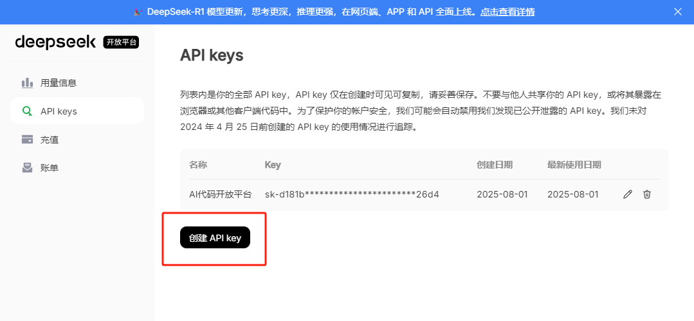

   在 `pom.xml` 中添加LangChain4j的依赖

   创建本地配置文件 `application-local.yml`，填写 Chat Model 配置。
   ```yaml 
   # AI
   langchain4j:
     open-ai:
       chat-model:
         base-url: https://api.deepseek.com
         api-key: <Your API Key>
         model-name: deepseek-chat
         log-requests: true
         log-responses: true

   ```

   为了保护敏感信息，我们需要在 `.gitignore` 中添加本地配置文件 `application-local.yml`，忽略该文件的提交，之后就可以放心地将敏感配置都写在这个文件里了。
   ```xml 
   ### CUSTOM ###
   application-local.yml

   ```

   在主配置文件中激活本地环境：
   ```yaml 
   spring:
     profiles:
       active: local

   ```

2. 开发AI服务

   在 src/main/resources/prompt 目录下新建提示词文件：
   - `codegen-html-system-prompt.txt`：原生 HTML 模式
   - `codegen-multi-file-system-prompt.txt`：原生三件套模式
     按照 LangChain4j 推荐的 AI Service 开发模式，在`ai` 包下创建服务接口 AiCodeGeneratorService
   在服务接口中添加 2 个生成代码的‌方法，分别对应 2 种生成‎模式：
   - generateHtmlCode()：生成 HTML 代码
   - generateMultiFileCode()：生成多文件代码
     在 `ai.model` 下创建**工厂类** AiCodeGeneratorServiceFactory 来初始化 AI 服务
   最后，编写单元测试来验证功能
3. 结构化输出

   在 `ai.model` 包下创建生成结果类，用于封装 AI 返回的内容：
   - HtmlCodeResult
   - MultiFileCodeResult
     修改 AI 服务接口，让方法返回结构化对象
   - generateHtmlCode：生成 HTML 代码
   - generateMultiFileCode：生成多文件代码
     相应地修改单元测试调用方‌法的返回值类型
   执行单元测试

   在执行测试的时候，可能会遇到报错：

   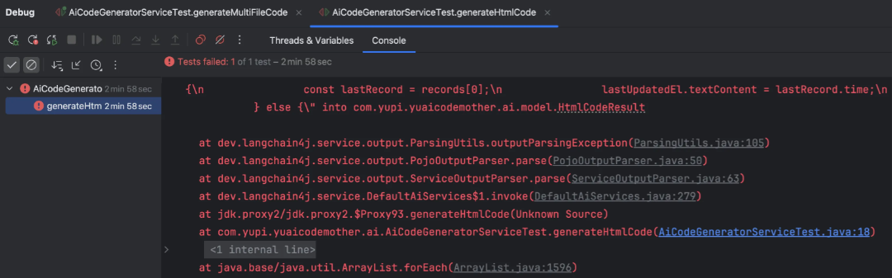

   **可能的原因**：
   - AI 服务返回了错误的响应格式（可能是 JavaScript 代码片段而非 JSON）
   - 服务端和客户端对响应格式的约定不一致
   - 可能是 AI 模型没有按照预期返回 HTML 代码，而是返回了其他内容
     为了严格确保结构化输出生效，可以在项目中使用这个配置：
   ```yaml 
   langchain4j:
     open-ai:
       chat-model:
         strict-json-schema: true
         response-format: json_object
   ```

4. 程序处理写入 - 门面模式

   有了结构化的输出对象，接下来‌就是将生成的代码保‎存到本地文件系统。
   - 首先定义生成类型枚举 CodeGenTypeEnum ，放在 `model.enums` 包下，因为后续其他的 Service 会用到。
   - 创建文件写入工具类 `CodeFileSaver`，放在 `core` 包下，表示核心业务代码。在临时目录 `tmp` 下保存文件，每次生成都对应一个临时目录下的文件夹，使用 **业务类型 + 雪花 ID** 的命名方式来确保唯一性。（记得将 `tmp` 目录添加到 `.gitignore` 中，避免生成的文件被提交到代码仓库。）
   - 为了统一管理生成和保存的逻辑，使用 **门面模式** 这一设计模式。
     - 在 `core` 包下创建 `AiCodeGeneratorFacade` 类
   - 编写单元测试验证整个流程。测试成功后，可以看到生成文件的保存路径；点击生成文件的 `index.html`，即可看到生成的网站效果。

### 3.4  SSE流式输出

1. 方案选择

   结构化输出的速度比较慢，用‍户需要等待较长时间才能看到结⁠果，这种体验显然不够好。为了提升用户体验，需要引入 SSE（‌Server-Sent ‎Events）流式输出，‍像打字机一样，AI 返回⁠一个词，前端输出一个词。

   **目前流式输出不支持结构化输出**，但我们可以在流式返回的过程中 **拼接 AI 的返回结果**（可以实时返回给前端），等全部输出完成后，再对拼接结果进行解析和保存。这样既保证了实时性，又不影响最终的处理流程。

   这里使用了 **LangChain4j + Reactor** 的模式。

   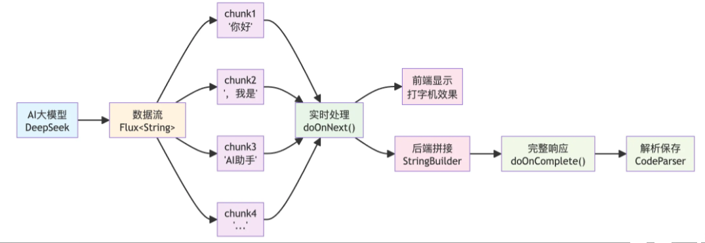

   Reactor 是指响应式编程，LangChain4j 提供了响应‌式编程依赖包，可以直接把 AI 返回的内容封‎装为更通用的 Flux 响应式对象。可以把 ‍Flux 想象成一个数据流，有了这个对象后，⁠上游发来一块数据，下游就能处理一块数据。

   这种方案的优点是与前端集成更方‌便，通过 Flux ‎对象可以很容易地将流‍式内容返回给前端。缺⁠点是需要引入额外的依赖：
   ```xml 
   <dependency>
     <groupId>dev.langchain4j</groupId>
     <artifactId>langchain4j-reactor</artifactId>
     <version>1.1.0-beta7</version>
   </dependency>

   ```

2. 开发实现
   - 首先配置流式模型
     ```yaml 
     langchain4j:
       open-ai:
         streaming-chat-model:
           base-url: https://api.deepseek.com
           api-key: <Your API Key>
           model-name: deepseek-chat
           max-tokens: 8192
           log-requests: true
           log-responses: true

     ```

   - 在创建 AI Service 的工厂类 AiCodeGeneratorServiceFactory 中注入流式模型
   - 在 AI Service‌ 中新增流式方法，‎跟之前方法的区别在‍于返回值改为了 F⁠lux 对象
     - generateHtmlCodeStream()：生成 HTML 代码（流式）
     - generateMultiFileCodeStream()：生成多文件代码（流式）
   - 编写解析逻辑
     - 由于流式输出返回的是字符串片‌段，我们需要在 A‎I 全部返回完成后进‍行解析。
     - 由于代码解析逻辑相对复杂，单独在 `core` 包下创建代码解析器 `CodeParser`。核心逻辑是通过正则表达式从完整字符串中提取到对应的代码块，并返回结构化输出对象，这样可以复用之前的文件保存器。
     - 编写一个单元测试类 CodeParserTest ，来验证解析器的功能
   - 在 `AiCodeGeneratorFacade` 中添加流式调用 AI 的方法
     - 针对每种生成模式，分别提供一个 “生成代码‌并保存” 的方法，核心逻辑都‎是：拼接 AI 实时响应的字‍符串，并在 流式返回完成后解⁠析字符串并保存代码文件。
     - generateAndSaveHtmlCodeStream()：生成 HTML 模式的代码并保存（流式）
     - generateAndSaveMultiFileCodeStream()：生成多文件模式的代码并保存（流式）
   - 在 `AiCodeGeneratorFacade` 中编写统一入口，根据生成模式枚举选择对应的流式方法
     - generateAndSaveCodeStream()：统一入口：根据类型生成并保存代码（流式）
   - 编写单元测试验证流式功能

### 3.5  代码优化（抽象）

1. 优化方案
   - 解析器部分：使用策略模式，不同类型的解析策略独立维护（难点是不同解析策略的返回值不同）
   - 文件保存部分：使用模板方法模式，统一保存流程（难点是不同保存方式的方法参数不同）
   - SSE 流式处理：抽象出通用的流式处理逻辑（目前每种生成模式都写了一套处理代码）
2. 方案介绍
   - 策略模式

     策略模式定义了一系列算法，将每个算‌法封装起来，并让它们可‎以相互替换，使得算法的‍变化不会影响使用算法的⁠代码，让项目更好维护和扩展。
   - 模版方法模式

     模板方法模式在抽象父类中定义了操作‌的标准流程，将一些具体‎实现步骤交给子类，使得‍子类可以在不改变流程的⁠情况下重新定义某些特定步骤。
   - 执行器模式

     正常情况下，可以通过工厂模式来创建不同的策略或模板方法，但由‌于每种生成模式的参数和返回值不同（Htm‎lCodeResult 和 MultiF‍ileCodeResult），很难对通过⁠工厂模式创建出来的对象进行统一的调用。

     对于方法参数不同的策略模式和‌模板方法模式，建议‎使用执行器模式（E‍xecutor）。

     执行器模式提供统一的执行入口来协调不同策‌略和模板的调用，特别适合处‎理参数类型不同但业务逻辑相‍似的场景，避免了工厂模式在⁠处理不同参数类型时的局限性。
   - 最终，我们预期的代码架构是一种 **混合模式**：
     - 执行器模式：提供统一的执行入口，根据生成类型执行不同的操作
     - 策略模式：每种模式对应的解析方法单独作为一个类来维护
     - 模板方法模式：抽象模板类定义了通用的文件保存流程，子类可以有自己的实现（比如多文件生成模式需要保存 3 个文件，而原生 HTML 模式只需要保存 1 个文件）
3. 开发实现
   - 优化解析器
     - 在 core 下新建 parser包
       - 定义接口 CodeParser\<T>，通过泛型统一方法的‌返回值
       - 编写 HTML 单文件代码解析器 HtmlCodeParser
       - 编写多文件代码解析器 MultiFileCodeParser
       - 编写代码解析执行器 CodeParserExecutor，根据代码生成类型执行相应的解析逻辑
   - 优化文件保存器
     - 在 core 下新建 saver包
       - 创建文件保存模板抽象类 CodeFileSaverTemplate\<T>，通过‌泛型统一了方法的调用‎参数
       - 编写 HTML 代码文件保存器 HtmlCodeFileSaverTemplate
       - 编写多文件代码保存器 MultiFileCodeFileSaverTemplate
       - 编写代码文件保存执行器 CodeFileSaverExecutor，根据‌代码生成类型执行相‎应的保存逻辑
   - 优化门面类
     - 修改 `AiCodeGeneratorFacade` 类，抽象出通用的流式代码处理方法
       ```java 
       /**
        * 通用流式代码处理方法
        *
        * @param codeStream  代码流
        * @param codeGenType 代码生成类型
        * @return 流式响应
        */
       private Flux<String> processCodeStream(Flux<String> codeStream, CodeGenTypeEnum codeGenType) {
           StringBuilder codeBuilder = new StringBuilder();
           return codeStream.doOnNext(chunk -> {
               // 实时收集代码片段
               codeBuilder.append(chunk);
           }).doOnComplete(() -> {
               // 流式返回完成后保存代码
               try {
                   String completeCode = codeBuilder.toString();
                   // 使用执行器解析代码
                   Object parsedResult = CodeParserExecutor.executeParser(completeCode, codeGenType);
                   // 使用执行器保存代码
                   File savedDir = CodeFileSaverExecutor.executeSaver(parsedResult, codeGenType);
                   log.info("保存成功，路径为：" + savedDir.getAbsolutePath());
               } catch (Exception e) {
                   log.error("保存失败: {}", e.getMessage());
               }
           });
       }

       ```

     - 修改 `AiCodeGeneratorFacade` 类中的 **统一入口方法**
       ```java 
       /**
        * 统一入口：根据类型生成并保存代码
        *
        * @param userMessage     用户提示词
        * @param codeGenTypeEnum 生成类型
        * @return 保存的目录
        */
       public File generateAndSaveCode(String userMessage, CodeGenTypeEnum codeGenTypeEnum) {
           if (codeGenTypeEnum == null) {
               throw new BusinessException(ErrorCode.SYSTEM_ERROR, "生成类型为空");
           }
           return switch (codeGenTypeEnum) {
               case HTML -> {
                   HtmlCodeResult result = aiCodeGeneratorService.generateHtmlCode(userMessage);
                   yield CodeFileSaverExecutor.executeSaver(result, CodeGenTypeEnum.HTML);
               }
               case MULTI_FILE -> {
                   MultiFileCodeResult result = aiCodeGeneratorService.generateMultiFileCode(userMessage);
                   yield CodeFileSaverExecutor.executeSaver(result, CodeGenTypeEnum.MULTI_FILE);
               }
               default -> {
                   String errorMessage = "不支持的生成类型：" + codeGenTypeEnum.getValue();
                   throw new BusinessException(ErrorCode.SYSTEM_ERROR, errorMessage);
               }
           };
       }

       /**
        * 统一入口：根据类型生成并保存代码（流式）
        *
        * @param userMessage     用户提示词
        * @param codeGenTypeEnum 生成类型
        */
       public Flux<String> generateAndSaveCodeStream(String userMessage, CodeGenTypeEnum codeGenTypeEnum) {
           if (codeGenTypeEnum == null) {
               throw new BusinessException(ErrorCode.SYSTEM_ERROR, "生成类型为空");
           }
           return switch (codeGenTypeEnum) {
               case HTML -> {
                   Flux<String> codeStream = aiCodeGeneratorService.generateHtmlCodeStream(userMessage);
                   yield processCodeStream(codeStream, CodeGenTypeEnum.HTML);
               }
               case MULTI_FILE -> {
                   Flux<String> codeStream = aiCodeGeneratorService.generateMultiFileCodeStream(userMessage);
                   yield processCodeStream(codeStream, CodeGenTypeEnum.MULTI_FILE);
               }
               default -> {
                   String errorMessage = "不支持的生成类型：" + codeGenTypeEnum.getValue();
                   throw new BusinessException(ErrorCode.SYSTEM_ERROR, errorMessage);
               }
           };
       }
       ```


## 4  应用模块

### 4.1  需求分析

需要的具体功能包括：

- 用户基础功能
- 创建应用
- 编辑应用信息
- 删除自己的应用
- 查看应用详情
- 分页查询自己的应用列表
- 分页查看精选应用列表
- 用户高级功能
- 管理功能
- 管理所有应用（删除、查询、修改）
- 设置精选应用
- ⭐️ 实时查看应用效果
- ⭐️ 应用部署

### 4.2  方案设计&#x20;

1. 核心业务流程

   用户在主页输入提示词后，系统会创建一个应用记录‌，然后跳转到对话页面与 AI ‎交互生成网站。生成完成后，用户‍可以预览效果，满意后进行部署，⁠让网站真正对外提供服务。

   这个流程涉及到**数据存储‌**、**权限控制**、**文件管理**、**‎网站部署**等多个技术环节‍。
2. 库表设计

   创建应用表app：
   ```sql 
   -- 应用表
   create table app
   (
       id           bigint auto_increment comment 'id' primary key,
       appName      varchar(256)                       null comment '应用名称',
       cover        varchar(512)                       null comment '应用封面',
       initPrompt   text                               null comment '应用初始化的 prompt',
       codeGenType  varchar(64)                        null comment '代码生成类型（枚举）',
       deployKey    varchar(64)                        null comment '部署标识',
       deployedTime datetime                           null comment '部署时间',
       priority     int      default 0                 not null comment '优先级',
       userId       bigint                             not null comment '创建用户id',
       editTime     datetime default CURRENT_TIMESTAMP not null comment '编辑时间',
       createTime   datetime default CURRENT_TIMESTAMP not null comment '创建时间',
       updateTime   datetime default CURRENT_TIMESTAMP not null on update CURRENT_TIMESTAMP comment '更新时间',
       isDelete     tinyint  default 0                 not null comment '是否删除',
       UNIQUE KEY uk_deployKey (deployKey), -- 确保部署标识唯一
       INDEX idx_appName (appName),         -- 提升基于应用名称的查询性能
       INDEX idx_userId (userId)            -- 提升基于用户 ID 的查询性能
   ) comment '应用' collate = utf8mb4_unicode_ci;

   ```

   这个设计中有几个值得注意的细节：
   - `priority` 优先级字段：我们约定 99 表示精选应用，这样可以在主页展示高质量的应用，避免用户看到大量测试内容。
   - 添加索引：给 deployKe‌y、appName、u‎serId 三个经常用‍于作为查询条件的字段增⁠加索引，提高查询性能。
   - 由于每个网站应用文件的部署都是隔离的（想象成沙箱），需要用唯一字段来区分， `deployKey` 字段可以作为应用的存储和访问路径；而且为了便于访问，每个应用的访问路径不能太长。

### 4.3  基础应用能力

1. 确定所需接口

   后端开发最终的目标是提供接口‌，我们先来实现一些‎基础的接口，也就是‍ “增删改查”：
   - 【用户】创建应用（须填写 initPrompt）
   - 【用户】根据 id 修改自己的应用（目前只支持修改应用名称）
   - 【用户】根据 id 删除自己的应用
   - 【用户】根据 id 查看应用详情
   - 【用户】分页查询自己的应用列表（支持根据名称查询，每页最多 20 个）
   - 【用户】分页查询精选的应用列表（支持根据名称查询，每页最多 20 个）
   - 【管理员】根据 id 删除任意应用
   - 【管理员】根据 id 更新任意应用（支持更新应用名称、应用封面、优先级）
   - 【管理员】分页查询应用列表（支持根据除时间外的任何字段查询，每页数量不限）
   - 【管理员】根据 id 查看应用详情
2. 基础代码生成
   - 使用 MyBatis F‌lex 代码生成器‎生成基础的 CRU‍D 代码。生成代码后，移动代码到对应的位置。将App 实体类中 ‌id 的生成方式改为雪花算法。
3. 核心功能实现
   - 创建应用

     用户创建应用时，只需要填写初‌始化提示词。系统会‎自动生成应用名称（‍取提示词前 12 ⁠位）和默认的代码生成类型。
   - 更新应用

     用户更新应用时，需要进行权限校验，确保只能修改自己的应用。

     这里需要手动设置 `editTime`，是为了区分用户主动编辑和系统自动更新的时间。
   - 用户删除应用

     需要进行权限校验，确保只能修改自己的应用。
   - 用户查看应用详情

     应用查询涉及到关联查询用户信息，需要创建 ‌App 的封装类，包含 Us‎erVO 用户信息字段。

     接口代码中，先查询 App，再查询封装类
   - 用户分页查询应用

     分页查询应用时，也需要额外获取创建‌应用的用户信息，这会涉‎及到关联查询多个用户信‍息，我们需要优化查询性⁠能。优化查询逻辑如下：
     - 先收集所有 userId 到集合中
     - 根据 userId 集合批量查询所有用户信息
     - 构建 Map 映射关系 userId => UserVO
     - 一次性组装所有 AppVO，根据 userId 从 Map 中取到需要的用户信息
   - 用户分页查询精选应用

     用户只‌能在主页查询精选应用列表（还‎有自己的），这样主页会更干净‍；同时避免了爬虫，相当于起到⁠了一个管理员审核的作用。
   - 管理员删除应用

     跟用户删除应用接口类似，但是‌管理员可以删除任意‎应用，可以通过权限‍注解校验权限：
   - 管理员更新应用

     管理员可以更新任意应用的应用‌名称、应用封面和优‎先级，更新优先级的‍操作其实就是精选。
   - 管理员分页查询应用

     管理员比普通用户拥有更大的查‌询范围，支持根据除‎时间外的任何字段查‍询，并且每页数量不⁠限。
   - 管理员查看应用详情

     这个接口除了权限之外，目前跟用户查看应用详情接口没有区别。
4. 测试

### 4.4  应用生成（后端）

1. 业务流程设计

   整个业务流程是：
   - 用户在主页输入提示词创建应用（入库）
   - 获得应用 ID 后跳转到对话页面
   - 系统自动使用初始提示词与 AI 对话生成网站代码
     由于应用的生成过程和 AI 对话是绑定的，我们可以提供一个名为`chatToGenCode` 的应用生成接口，调用之前开发的 AI 代码生成门面完成任务，并且流式返回给前端。前端不需要区分用户是否是第一次和该应用对话，始终调用这个接口即可，需要怎么做都交给后端来判断。
   一定要确保生成的文件能够与应用正确关联，因此这次生成的网站目录名称不再是之前的`codeType_雪花算法`，而是`codeGenType_appId`，这样就能通过 appId 查数据库获取应用信息、再根据应用信息找到对应的网站目录了。
2. 服务开发

   **业务逻辑：** 用户输入提示词（`userMessage`），系统根据对应应用（`appId`）所配置的代码生成类型（如 HTML 或多文件），调用 AI 模型流式或一次性生成代码，然后将生成结果解析并保存到以`"代码类型_应用ID"`命名的唯一目录下。整个流程包括参数校验、权限检查、代码生成、结果解析、目录创建和文件保存等步骤，采用了模板方法模式来规范保存流程，并通过枚举类型动态分发具体的生成和保存逻辑，支持同步和异步流式两种调用方式，方便集成前端界面或第三方系统。
   | 功能块                                                             | 所属类/接口                               | 作用说明                                                                               |
   | --------------------------------------------------------------- | ------------------------------------ | ---------------------------------------------------------------------------------- |
   | \`saveCode()\`                                                  | \`AbstractCodeFileSaver\<T>\`        | \*\*模板方法\*\*，封装统一保存流程，包括输入验证、目录创建和文件保存（由子类实现）                                      |
   | \`buildUniqueDir()\`                                            | \`AbstractCodeFileSaver\<T>\`        | 构建以\`代码类型\_应用ID\`命名的\*\*唯一目录路径\*\*，并创建目录                                           |
   | \`executeSaver()\`                                              | \`CodeFileSaverExecutor\`            | 根据\`CodeGenTypeEnum\`枚举，\*\*选择合适的代码保存器（如 HTML、MULTI\\\_FILE）\*\*并调用其\`saveCode()\` |
   | \`generateAndSaveCode()\`                                       | \`AiCodeGeneratorFacade\`            | 入口方法之一，\*\*一次性生成并保存代码\*\*，适合简单或较短的代码生成场景                                           |
   | \`generateAndSaveCodeStream()\`                                 | \`AiCodeGeneratorFacade\`            | 入口方法之二，\*\*支持流式代码生成和保存\*\*，适合较长内容或分段生成                                             |
   | \`processCodeStream()\`                                         | \`AiCodeGeneratorFacade\`            | 对流式代码片段进行拼接、解析、保存，是\`generateAndSaveCodeStream()\` 的内部实现逻辑                         |
   | \`chatToGenCode()\`                                             | \`AiCodeGeneratorServiceImpl\`       | 面向前端或外部调用的\*\*统一入口方法\*\*，包含应用权限校验、类型解析和流式调用                                        |
   | 测试方法：\`generateAndSaveCode()\`  \`generateAndSaveCodeStream()\` | \`AiCodeGeneratorFacadeTest\`\&#x20; | 用于\*\*验证完整流程正确性\*\*，分别覆盖非流式和流式场景                                                   |
3. SSE流式接口开发

   AppController 新增接口‌，注意要声明为 SSE ‎流式返回，使用 get ‍请求便于前端使用 Eve⁠ntSource 对接：
   ```java 
   /**
    * 应用聊天生成代码（流式 SSE）
    *
    * @param appId   应用 ID
    * @param message 用户消息
    * @param request 请求对象
    * @return 生成结果流
    */
   @GetMapping(value = "/chat/gen/code", produces = MediaType.TEXT_EVENT_STREAM_VALUE)
   public Flux<String> chatToGenCode(@RequestParam Long appId,
                                     @RequestParam String message,
                                     HttpServletRequest request) {
       // 参数校验
       ThrowUtils.throwIf(appId == null || appId <= 0, ErrorCode.PARAMS_ERROR, "应用ID无效");
       ThrowUtils.throwIf(StrUtil.isBlank(message), ErrorCode.PARAMS_ERROR, "用户消息不能为空");
       // 获取当前登录用户
       User loginUser = userService.getLoginUser(request);
       // 调用服务生成代码（流式）
       return appService.chatToGenCode(appId, message, loginUser);
   }

   ```

4. 接口测试
5. SSE流式接口优化

   还要对 ‍SSE 接口进行优⁠化，解决 2 个问题：
   - 空格丢失问题：前端使用 EventSour‌ce 对接目前的接‎口时，会出现空格丢‍失问题。解决方案是在后端封装数据，将 Flux 额外封装成 ServerSentEvent，把原始数据放到 JSON 的 `d` 字段内：
     ```java 
     @GetMapping(value = "/chat/gen/code", produces = MediaType.TEXT_EVENT_STREAM_VALUE)
     public Flux<ServerSentEvent<String>> chatToGenCode(@RequestParam Long appId,
                                                        @RequestParam String message,
                                                        HttpServletRequest request) {
         // 参数校验
         ThrowUtils.throwIf(appId == null || appId <= 0, ErrorCode.PARAMS_ERROR, "应用ID无效");
         ThrowUtils.throwIf(StrUtil.isBlank(message), ErrorCode.PARAMS_ERROR, "用户消息不能为空");
         // 获取当前登录用户
         User loginUser = userService.getLoginUser(request);
         // 调用服务生成代码（流式）
         Flux<String> contentFlux = appService.chatToGenCode(appId, message, loginUser);
         // 转换为 ServerSentEvent 格式
         return contentFlux
                 .map(chunk -> {
                     // 将内容包装成JSON对象
                     Map<String, String> wrapper = Map.of("d", chunk);
                     String jsonData = JSONUtil.toJsonStr(wrapper);
                     return ServerSentEvent.<String>builder()
                             .data(jsonData)
                             .build();
                 });
     }

     ```

   - 主动告诉前端生成完成：在 SSE 中，当服务器关闭连接时，会触发客户端的`onclose`事件，这是前端判断流结束的标准方式。但是，`onclose`事件会在连接正常结束（服务器主动关闭）和异常中断（如网络问题）时都触发，前端就很难区分到底后端是正常响应了所有数据、还是异常中断了。因此，我们最好在后端添加一个明确的`done` 事件，这样可以更清晰地区分流的正常结束和异常中断。
     ```java 
     @GetMapping(value = "/chat/gen/code", produces = MediaType.TEXT_EVENT_STREAM_VALUE)
     public Flux<ServerSentEvent<String>> chatToGenCode(@RequestParam Long appId,
                                                        @RequestParam String message,
                                                        HttpServletRequest request) {
         // 参数校验
         ThrowUtils.throwIf(appId == null || appId <= 0, ErrorCode.PARAMS_ERROR, "应用ID无效");
         ThrowUtils.throwIf(StrUtil.isBlank(message), ErrorCode.PARAMS_ERROR, "用户消息不能为空");
         // 获取当前登录用户
         User loginUser = userService.getLoginUser(request);
         // 调用服务生成代码（流式）
         Flux<String> contentFlux = appService.chatToGenCode(appId, message, loginUser);
         // 转换为 ServerSentEvent 格式
         return contentFlux
                 .map(chunk -> {
                     // 将内容包装成JSON对象
                     Map<String, String> wrapper = Map.of("d", chunk);
                     String jsonData = JSONUtil.toJsonStr(wrapper);
                     return ServerSentEvent.<String>builder()
                             .data(jsonData)
                             .build();
                 })
                 .concatWith(Mono.just(
                         // 发送结束事件
                         ServerSentEvent.<String>builder()
                                 .event("done")
                                 .data("")
                                 .build()
                 ));
     }

     ```


### 4.5  应用部署（后端）

之前我们是在本地手动双击打开‌ HTML 文件来‎查看网站生成效果的‍，但现在平台化了，⁠肯定不能让用户也这么干。

部署的整体思路是：把本地生成的文件同步到一个 **Web 服务器** 上。可以是同一个服务器的不同目录，也可以是不同服务器，但显然前者成本更低。

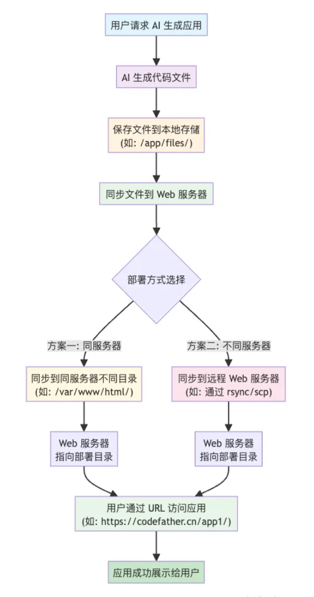

使用方案：使用 Spring B‎oot 接口实现 AI ‍生成的网页预览，使用 N⁠ginx 提供网站部署服务。

部署接口接受 appId 作为请求参数，返回可访问的 URL 地址`${部署域名}/{deployKey}`。

部署流程如下：

1. 参数校验：比如是否存在 App、用户是否有权限部署该应用（仅本人可以部署）
2. 生成 deployKey：之前设计库表时已经提到了 deployKey 的生成逻辑（6 位大小写字母 + 数字），还要注意不能跟已有的 key 重复；此外，每个 app 只生成一次 deployKey，已有则不生成。
3. 部署操作：本质是将 `code_output` 目录下的临时文件复制到 `code_deploy` 目录下，为了简化访问地址，直接将 deployKey 作为文件名。

这个实现的优点在于支持重复部署。如果应用已经有 deplo‌yKey，就直接使用现有的；如果没有，‎就生成一个新的。这样既保证了 URL ‍的稳定性，又支持了代码的更新。缺点是不⁠支持区分同一个应用多次部署的版本。

**Nginx部署流程：**

- 首先到[Nginx 官网](https://nginx.org/en/download.html "Nginx 官网") 下载 Nginx，各个操作系统的安装包都有。
- 下载好 Nginx 后，找到 Nginx 配置文件`nginx.conf`
- 修改 Nginx 配置，‌http 块中添加‎ server 块‍，配置 root ⁠为项目部署根目录
  ```nginx 
  # 静态资源服务器 - 80 端口
  server {
      listen       80;
      server_name  localhost;
      charset      utf-8;
      charset_types text/css application/javascript text/plain text/xml application/json;
      # 项目部署根目录
      root         xxx/tao-ai-code-platform/tmp/code_deploy; （填写自己项目的绝对路径）
      
      # 处理所有请求
      location ~ ^/([^/]+)/(.*)$ {
          try_files /$1/$2 /$1/index.html =404;
      }
  }

  ```

  注意，Windows 系统的路径斜杠要相反，比如`C:/code/yu-ai-code-mother_live/tmp/code_deploy`
- 上述配置中使用了`try_files`指令，能够按顺序尝试多个文件路径，从而更灵活地处理文件访问。举个例子，当访问`/app/style.css`时，会先尝试找到`/app/style.css`文件，如果不存在则返回`/app/index.html`，最后才返回 404 错误，这样能够适配后续我们要生成的 Vue 单页面应用。

  try\_files 指令的具体解释：
  - /\$1/\$2：第一个尝试的路径
  - /\$1/index.html：第二个尝试的路径
  - \=404：如果都找不到，返回 404 错误
    举些例子：
    \| 访问URL            | \\\$1  | \\\$2       | 尝试路径1            | 尝试路径2            |
    \| ---------------- | ------ | ----------- | ---------------- | ---------------- |
    \| /app/            | app    | ""          | /app/            | /app/index.html  |
    \| /app/style.css   | app    | style.css   | /app/style.css   | /app/index.html  |
    \| /app/js/main.js  | app    | js/main.js  | /app/js/main.js  | /app/index.html  |
- 启动 Nginx，或者输入命令 nginx -s reload 来重载配置
- 然后直接访问 80 端口，就能看到网站了：

  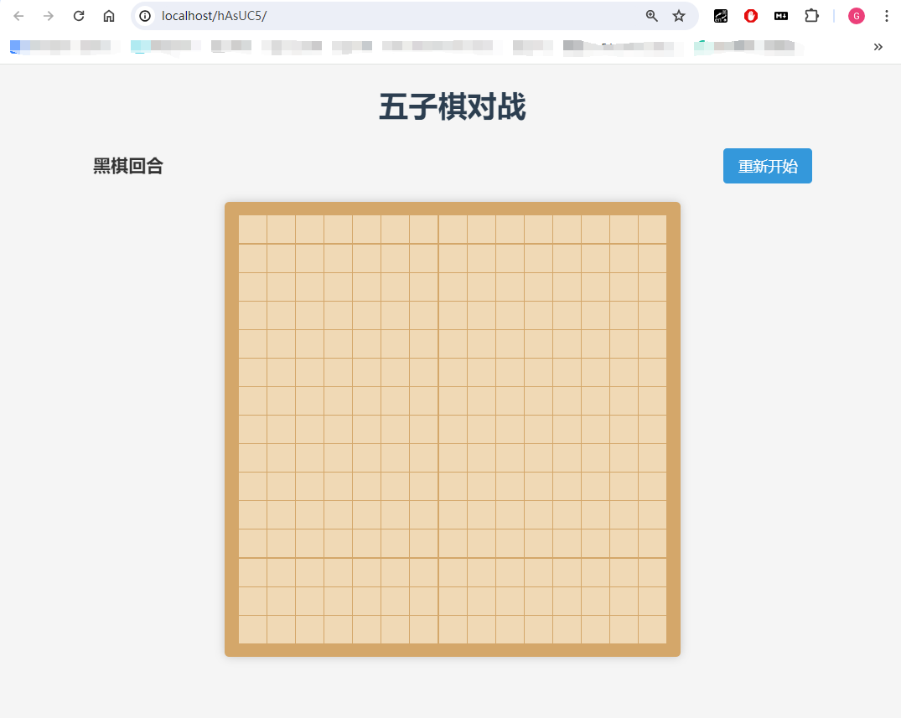

这种方案的性能最佳，最适合生‌产环境；缺点是需要‎额外引入 Nginx‍ 组件。

### 4.6  前端开发

- 需求介绍：用户可以在本网站通过和 AI 对话创建网站应用、查看生成的网站应用效果、部署应用、管理个人应用、查看精选应用；管理员可以对整个网站的任意应用进行管理。
  - 【用户】输入用户提示词来创建应用
  - 【用户】修改自己的应用信息（目前只支持修改应用名称）
  - 【用户】删除自己的应用
  - 【用户】查看应用详情
  - 【用户】通过和 AI 对话生成网站应用，并查看效果
  - 【用户】部署应用
  - 【用户】分页查询自己的应用列表（支持根据名称查询，每页最多 20 个）
  - 【用户】分页查询精选的应用列表（支持根据名称查询，每页最多 20 个）
  - 【管理员】删除任意应用
  - 【管理员】更新任意应用信息（支持更新应用名称、应用封面、优先级）
  - 【管理员】分页查询应用列表（支持根据除时间外的任何字段查询，每页数量不限）
  - 【管理员】查看任意应用详情
- 业务流程：
  - 用户在主页输入框输入提示词后，调用创建应用接口得到应用 id，然后跳转到对话页面；自动将应用的初始提示词作为消息发送给 AI，并且通过 SSE 对话接口实时输出 AI 的回复；当 AI 回复完后，自动在右侧展示生成的网站效果。（本地域名为 [<http://localhost:8123/api/static/{codeGenType}> \_{appId}/）](http://localhost:8123/api/static/{codeGenType}_{appId}/） "http://localhost:8123/api/static/{codeGenType}_{appId}/）") &#x20;
  - 用户可以在对话页面部署网站，调用后端部署接口，得到可访问的 URL 地址。 &#x20;
  - 其他业务参考需求介绍，调用对应的后端接口实现

## 5  对话历史模块

### 5.1  需求分析

需要实现以下需求：

- 对话历史的持久化存储：用户发送消息时，‌需要保存用户消息；AI 成功‎回复后，需要保存 AI 消息‍。即使 AI 回复失败，也要⁠记录错误信息，确保对话的完整性。
- 应用级别的数据隔离：每个应‌用的对话历史都是独‎立的。删除应用时，需要‍关联删除该应用的所有⁠对话历史，避免数据冗余。
- 对话历史查询：支持分页查看某个应用的对话历史，需要区分用户和 AI 消息。类似聊天软件的消息加载机制，每次加载最新 10 条消息，支持**向前加载** 更多历史记录。（仅应用创建者和管理员可见）

  详细来说，进入应用页面时，前端根据应用 id 先加载一次对话历史‌消息，关联查询最新 10 条消息。

  如果存在‎历史对话，直接展示；如果没有历史记录，才自‍动发送初始化提示词。

  这样就解决了浏览别⁠人的应用时意外触发对话的问题。
- 管理对话历史：管理员可以‌查看所有应用的对话‎历史，按照时间降序‍排序，便于内容监管⁠。

### 5.2  方案设计

1. 分页查询
   - 传统分页查询

     在传统分页中，数据通常是 **基于页码或偏移量** 进行加载的。如果数据在分页过程发生了变化，比如插入新数据、删除老数据，用户看到的分页数据可能会出现不一致，导致用户错过或重复某些数据。

     举个例子，假设用户会持续收到新的消息。如果按照传统分页基于偏移量‌加载，第一页已经加载了第 1 - 5 行的‎数据，结果在查询第二页前，突然用户又‌收到了 5 条新消息。这样就导致查询出的第二页数据‌，正好是之前已经查‎询出的第一页的数据‍，造成了消息重复加⁠载。

     此外，传统的 offset 分页方式在处理大量对话数据时存在严重的性能问题。假设一个热门应用积累了几万条对话记录后，如果用户想查看较早的历史消息，执行 `LIMIT 10000, 10` 这样的查询会非常缓慢。
   - 游标查询

     使用一个游标来跟踪分页位置，而不是基于页码，**每次请求从上一次请求的游标开始加载数据。**

     游标查询通过基于唯一有序字段（如主键ID或时间戳）的锚点定位数据，相比传统分页的OFFSET/LIMIT机制，具有三大核心优势：**性能更优**（直接索引定位避免全表扫描）、**数据一致性更强**（新增/删除数据不会导致分页漂移）、**更适合动态流式数据**（如聊天记录或实时消息）。其本质是通过记录最后一条数据的位置标记（游标）来实现稳定分页，避免了传统分页在大数据量下的性能衰减和页码跳转时的数据重复/丢失问题，尤其适合无限滚动、实时消息等高频更新的场景。
2. 库表设计

   创建对话历史表：
   ```sql 
   -- 对话历史表
   create table chat_history
   (
       id          bigint auto_increment comment 'id' primary key,
       message     text                               not null comment '消息',
       messageType varchar(32)                        not null comment 'user/ai',
       appId       bigint                             not null comment '应用id',
       userId      bigint                             not null comment '创建用户id',
       createTime  datetime default CURRENT_TIMESTAMP not null comment '创建时间',
       updateTime  datetime default CURRENT_TIMESTAMP not null on update CURRENT_TIMESTAMP comment '更新时间',
       isDelete    tinyint  default 0                 not null comment '是否删除',
       INDEX idx_appId (appId),                       -- 提升基于应用的查询性能
       INDEX idx_createTime (createTime),             -- 提升基于时间的查询性能
       INDEX idx_appId_createTime (appId, createTime) -- 游标查询核心索引
   ) comment '对话历史' collate = utf8mb4_unicode_ci;

   ```


### 5.3  对话历史后端开发

1. 基础代码生成

   使用 MyBatis Flex 生成器生成 chat\_history表 的基础代码
2. 核心功能实现
   - 新增对话历史

     对话历史的保存需要在 **用户发送消息** 和 **AI 回复完成** 这两个时机进行。无论 AI 回复成功还是失败，都要留下完整的对话记录，确保用户能够了解完整的交互历史。
   - 关联删除

     当应用被删除时，需要同步清理对话历史数据。
   - 游标查询
   - 管理员查询功能

     管理员可以分页查询所有应用的‌对话历史消息列表，‎按照时间降序排序。

### 5.4  对话历史前端开发

需求介绍：

- 修改应用对话页面
  - 进入应用对话页面时，前端调用游标查询对话历史接口，根据应用 id 加载一次最近 10 条对话历史消息，按照消息创建时间的升序展示在对话区域（区分 AI 和用户消息）。
  - 如果消息数量超过 10 条（10 条为一页），可以点消息上方的加载更多，利用游标加载下一页历史消息。(我想前端需要维护已加载的消息列表)
  - 修改自动发送初始消息的逻辑。移除之前页面 url 的 view 参数，如果是自己的 app，并且没有对话历史，才自动将 initPrompt 作为第一条消息触发对话。
  - 修改网站展示的逻辑。进入页面时，如果 app 有至少 2 条对话记录，也展示对应的网站。
- 新增对话管理页面。完全参考应用管理页面实现

### 5.5  对话记忆

1. 方案设计

   之前我们已经在数据库中保存了用‌户和 AI 的消息，只需要在‎初始化会话记忆时，加载最新的‍对话记录到 Redis 中，⁠就能确保 AI 了解交互历史。

   流程：AI 对话 => 从数‌据库中加载对话历史‎到 Redis =‍> Redis 为⁠ AI 提供对话记忆。

   此外，每个应用的对话记忆应该是‌相互隔离的，Lang‎Chain4j 也提‍供了对话记忆隔离的能⁠力
2. 开发实现
   - 引入依赖
     ```yaml 
     <dependency>
       <groupId>dev.langchain4j</groupId>
       <artifactId>langchain4j-community-redis-spring-boot-starter</artifactId>
       <version>1.1.0-beta7</version>
     </dependency>
     ```

     这个依赖会引入 Redis 的 Jedis 客‌户端，以及与 LangChai‎n4j 的整合组件。  
   - 配置Redis
   - 使用对话记忆
     - 使用AI Service隔离不同应用的对话：之前所有应用共用同一个 AI Service 实‌例，如果想隔离会话记忆，可以给每‎个应用分配一个专属的 AI Se‍rvice，每个 AI Serv⁠ice 绑定独立的对话记忆。
     - 修改 AI Service ‌工厂类，提供根据 ‎appId 获取 ‍AI Servic⁠e 服务的方法。
   - 本地缓存优化
     - 利用 [Caffeine 本地缓存](https://github.com/ben-manes/caffeine "Caffeine 本地缓存") 进一步优化性能。
     - 每次构造完 appId 对应的 AI 服务实例后，利用 Caff‌eine 缓存来存储，之后相同 appId‎ 就能直接获取到 AI 服务实例，避免重‍复构造。注意，本地缓存占用的是内存，所以必须⁠设置合理的过期策略防止内存泄漏。
     - 缓存策略： &#x20;
       - 最大缓存 1000 个实例 &#x20;
       - 写入后 30 分钟过期 &#x20;
       - 访问后 10 分钟过期
   - 历史对话加载
     - 对话记忆初始化时，‌需要从数据库中加载‎对话历史到记忆中。
     - 查询起始点设置为 1 而不是 0，这是为了排除最新的用户消息。因为在对话流程中，用户消息被添加到数据库后，AI 服务也会自动将用户消息添加到记忆中，如果不排除会导致消息重复。
     - 注意反转从数据库中查到的消息列表，确保加载到记忆中的消息是按时间正序的。
     - 加载前先清理 Redis 中的历史对话记忆，防止重复加载。
   - 测试

### 5.6  Redis分布式Session

之前每次重启服‎务器都需要重新登录，现在可以使用‍ Redis 管理 Sessio⁠n 登录态，实现分布式会话管理。
